# E2E Pipeline

This document explains the full processing pipeline for the face-inversion
project: how we take a subject's head-cam video and EEG recording, find the
moment they looked at a printed face, show that same face to a convolutional
neural network (CNN), and finally ask whether the network's internal activity
carries the same **upright-vs-inverted** face signal that the brain does.

The exact same pipeline is run for two networks — **CORnet-S** (a model built to
imitate the primate ventral visual stream) and **ResNet-50** (a standard
object-recognition network) — so the two can be compared like for like. The two
runs live in `src/eda/nn_models/cornet_full_run_yunet_detection.ipynb` and
`resnet_full_run_yunet_detection.ipynb`; they are line-for-line identical except
for which model they load.

The write-up is deliberately technical *and* plain: each stage names the real
functions involved, but explains what they do in words a non-specialist can
follow.

---

## The whole pipeline in one breath

For each subject we line their EEG button-presses up with the head-cam video,
grab the exact frame they were looking at, feed that face to the CNN, and record
what every layer did. Then we ask, layer by layer, whether the network responds
differently to **inverted** vs **upright** faces — and whether that difference is
consistent enough to look like the brain's.

Stage by stage:

1. **Align** — use `Triggers.xlsx` column K to map each EEG face-event onto the
   right video frame (fixing the two-clocks trim bug).
2. **Face events** — turn the triggers into a list of `(video time, UP/IN)`, and
   label the left/right face of each two-face sheet.
3. **Grab the frame** — seek the video to each event and pull one RGB frame.
4. **Detect + crop** *(facecrop mode only)* — YuNet finds the small printed face
   (de-letterbox → 2× upscale → detect at 0° **and** 180°) and cuts a square crop;
   `full_frame` mode skips this and uses the whole scene.
5. **Forward pass** — run the face through the CNN and capture each layer's
   activation (V1/V2/V4/IT for CORnet, layer1–4 for ResNet), flattened per image.
6. **Cache** — save every subject's per-event activations to a `.npz` so the
   expensive model run happens only once.
7. **Encoding GLM** — per subject × layer, the slope β of activation on the ±0.5
   inversion regressor: how strongly that layer separates inverted from upright.
8. **Group t-test** — one-sample t-test of the 8 subjects' βs against zero → t(7),
   the "is the effect consistent?" number.
9. **Compare to the brain** — put each layer's t next to the EEG posterior-ROI
   reference, t(7) = 3.24, p = 0.014.

The single output is: *does this network carry the brain's upright-vs-inverted
signal, and in which layer?*

---

## Pipeline overview

```mermaid
flowchart LR
    A["<b>Inputs per subject</b><br/>head-cam video (.mp4)<br/>EEG recording (.set)<br/>Triggers.xlsx"] --> B

    B["<b>Stage 1 — Alignment</b><br/>map EEG event ↔ video frame<br/>via Triggers.xlsx column K<br/>(yunet_utils)"] --> C

    C["<b>Stage 2 — Face events</b><br/>list of (t_video, UP/IN)<br/>+ left/right pair roles"] --> D

    D["<b>Stage 3 — Grab the frame</b><br/>seek video to each event<br/>(one RGB frame per face)"] --> E

    E{"<b>Stage 4</b><br/>input mode?"}
    E -->|full_frame| G
    E -->|facecrop| F

    F["<b>YuNet detect + crop</b><br/>de-letterbox → 2x upscale →<br/>0°/180° detect → square crop"] --> G

    G["<b>Stage 5 — CNN forward pass</b><br/>hook V1/V2/V4/IT (CORnet)<br/>or layer1..4 (ResNet)<br/>flatten activations per layer"] --> H

    H["<b>Stage 6 — Cache</b><br/>sub{N}_cropped.npz /<br/>sub{N}_full_frame.npz"] --> I

    I["<b>Stage 7 — Encoding GLM</b><br/>β = slope of activation on the<br/>±0.5 inversion regressor,<br/>per subject x layer"] --> J

    J["<b>Random-effects t-test</b><br/>one-sample t-test of the 8<br/>subject βs → t(7), p"] --> K

    K["<b>Compare to the brain</b><br/>vs EEG posterior-ROI reference<br/>t(7) = 3.24, p = 0.014"]
```



Everything below walks these stages in order. The stable machinery lives in four
importable modules so the notebooks stay thin and the two model runs cannot drift
apart:

| Module | Role |
| --- | --- |
| `eeg_utils.py` (`eu`) | Load the EEG, read `Triggers.xlsx`, build the face regressor |
| `yunet_utils.py` (`yu`) | **Corrected alignment + YuNet face detection** — imported by *both* model runs |
| `cornet_utils.py` (`cu`) | CORnet-S model, hooks, and all the video/preprocessing/crop plumbing |
| `resnet_utils.py` (`ru`) | ResNet-50 model; re-uses `cu`'s plumbing verbatim |

---

## Stage 1 — Aligning the EEG to the video

**What "alignment" means.** Each subject wore a head-camera *and* a 64-channel
EEG cap while walking past small **printed faces** on walls (the mobile-EEG
face-inversion paradigm, Krugliak & Clarke 2022). When they saw a face they
pressed a button, which drops an `UP` (upright) or `IN` (inverted) marker into the
EEG. To show the network *the same picture the person saw*, we need to know which
**video frame** corresponds to each EEG button-press. That mapping is "alignment,"
and getting it right is the single most error-prone part of the whole pipeline.

**Why it was hard — two clocks.** The obvious mapping is `t_video = onset − t1`
(event time minus video-start time). It is wrong, and subtly so. The EEG `.set`
files were **trimmed at the front by a whole number of seconds**, so the event
onsets stored in the `.set` live in a *trimmed* clock, while `t1` (read from
`Triggers.xlsx`) lives in the *original* recording clock. Subtracting one from the
other mixes two clocks and lands on the wrong frame — off by exactly the trim.
This was diagnosed in `face_alignment.ipynb`: regressing the `.set` onsets against
the spreadsheet's original-clock times gives a slope of **exactly 1.000000** with
**0.0 ms residual** (a pure shift, not clock drift), and the shift is the trim:

i.e. (t1 - trim) how many seconds were **cut off the front of the EEG .set recording**

| sub | 1 | 2 | 3 | 4 | 5 | 6 | 7 | 8 |
| --- | --- | --- | --- | --- | --- | --- | --- | --- |
| front trim (s) | 90 | 51 | **0** | **0** | 33 | 0 | 155 | 39 |

Subjects 3, 4, 6 only ever appeared to "work" because their trim happens to be 0.

**The fix — column K.** `Triggers.xlsx` already contains the answer in column K
("Time in video frame rate"). K is built from two quantities that are *both* in
the original clock, so the trim cancels by construction — no trim arithmetic
needed. K also folds in a frame-rate factor of exactly **0.96 (= 24/25)** for the
two 25-fps subjects (1 and 2) and **1.0** for the 30-fps subjects. So the video
seek time is simply:

```
t_video = K (original clock, trim-invariant — use directly)
```

and to map a video time *back* onto the EEG signal (needed for the dense sampling
path, Stage 7):

```
t_eeg   = K / fps_factor + t1 − trim (back into the trimmed .set clock)
```
fps_factor = 1 (if 30 fps, since 30 fps (actual) / 30 fps (claimed)) or 0.96 (if 25 fps, since 24 fps (actual) / 25 fps (claimed))
  - Col K / Col H (the real elapsed time divided by the video file's own clock i.e. frame_index / claimed_fps)

and we minus the 'trim' since the **EEG starts before the video**

The `t1 − trim` term is the entire fix in one line: it reconciles the
original-clock `t1` with the trimmed-clock EEG signal.

**In code.** `yu.xlsx_face_events(sub)` returns the `(t_video, "UP"|"IN")` list
straight from column K; `yu.fps_factor(sub)` derives the 0.96/1.0 factor from the
sheet; `yu.video_trim_s(sub)` re-measures the trim by regression and *asserts the
slope is ≈ 1.0* (it raises if it ever sees real clock drift, since the K fix
assumes a pure shift); `yu.video_to_eeg(t_video, sub)` implements the inverse map.
`eu.get_t1` and `eu.get_face_events` supply `t1` and the raw markers.

---

## Stage 2 — Face events and left/right pairing

The stimuli are A4 sheets that each carry **two faces side by side**. The button
presses come in pairs: one for the **left** face, then ~2 s later one for the
**right** face of the same sheet, with ~10 s between pairs. If we always cropped
the single highest-scoring face, both members of a pair would often collapse onto
the *same* face — bad for any analysis that treats them as two distinct images.

`yu.pair_roles(times)` recovers the structure: it walks the time-sorted events and
labels the two members of each close pair `'left'` / `'right'` (grouping by the gap
size, `PAIR_GAP_S = 5.0` s, not by even/odd index, because some subjects' pairing
is phase-shifted), e.g. sub2 might start mid-pair, so "event 0, 2, 4… = left" would be wrong. The role is later handed to the detector so a left press reads
off the leftmost on-screen face and a right press the rightmost. This matters only
for the `facecrop` inputs; it never touches the EEG labels, which come from the
triggers, not the picture.

---

## Stage 3 — Grabbing the frame

`cu.open_video(sub)` opens the head-cam `.mp4` and reports its frame rate;
`cu.grab_frame(cap, t_video, fps)` seeks to frame `round(t_video · fps)` and
returns it as an RGB image. (ResNet calls `ru.grab_frame`, which *is* the same
function — see Stage 8.) `yu.is_dark(frame)` flags frames that are effectively
black: only subject 5 has any, caused by ~14.5% camera dropout in their video,
and those events are treated as **missing data**, not detection failures.

---

## Stage 4 — Finding and cropping the face (YuNet)

Stage 4 only runs in `facecrop` mode; `full_frame` mode skips straight to Stage 5 with the whole scene.

> This replaces an earlier Haar-cascade detector. Haar's hard 50 px minimum cut
> into the stimuli — six of eight subjects have faces below 50 px (smallest
> ~26 px), and subjects 1–2 are tiny portrait video — so it missed most faces.
> YuNet is a small purpose-built face-detection CNN that handles small faces and,
> crucially, returns a **real 0–1 confidence** instead of Haar's uncalibrated
> score. The relevant helpers are `yu.detect_face_bbox` (*find* the face) and
> `cu.crop_to_face` (*cut* around it).

**Step 0 — the detector.** `cv2.FaceDetectorYN` runs YuNet from a 232 KB ONNX file
in `data/models/`, auto-downloaded on first use. Its per-face score is a genuine
probability, so the threshold `YUNET_THRESH = 0.3` means the same thing across
every subject and video.

**Step 1 — Crop.** The portrait footage is padded into a landscape frame,
so ~66% of most frames is black bars. `yu.content_bbox` finds the bounding box of
the non-black content and crops to it first, so the detector spends its pixels on
the actual scene. The crop offset is remembered so boxes can be mapped back to
original-frame coordinates later.

**Step 2 — 2x upscale.** The printed faces are physically small in the frame, so
the de-letterboxed content is upscaled 2x (`YUNET_UPSCALE = 2.0`, bicubic) to give
the detector more pixels to work with. **This is also needed for passing the minimum-size floor an image that can be passed into YuNet**

**Step 3 — detect at 0° *and* 180° (the inversion trick).** This is the key move
for this study: **half the stimuli are upside-down**, and YuNet (like every face
detector) is trained on upright faces. So the detector runs **twice** — once on the
frame as-is, once rotated 180° — and any face it can only recognise when flipped
upright is still found. Boxes from the rotated pass are mapped back to the original
frame (`x, y = W − x − w, H − y − h`). The rotation is used **only to locate** the
face; the crop always keeps the frame's original orientation, so an inverted face
stays inverted (exactly what the analysis needs).

**Step 4 — dedupe, threshold, and pick.** Faces found in both passes are merged
(a candidate within half a face-width of an already-kept one is dropped), so
selection sees distinct physical faces rather than a 0°/180° duplicate of one face.
Then, using the left/right role from Stage 2, `yu.detect_face_bbox` returns:

- `role=None` — the single highest-scoring face (default, drop-in behaviour);
- `role='left'`/`'right'` — the leftmost / rightmost face among those clearing the
  0.3 threshold, falling back to top-score when fewer than two faces qualify.

If nothing clears the threshold it returns `None`.

**Step 5 — crop to a square (`cu.crop_to_face`).** Given the box, it cuts a
**square** window centred on the face, with side `max(w, h) · (1 + margin)` and
`margin = 0.6` (60% padding, so hair/chin/context are included), clamped so it
never runs off the frame edge. Square matters because the next step resizes to
224x224 — feeding a square avoids squashing the face's aspect ratio.

**Step 6 — the no-face fallback.** If the detector returned `None`,
`cu.crop_to_face` falls back to the **central square** of the frame (which also
drops the black bars, since the printed portrait is roughly centred).

**Step 7 — what the network receives.** The square crop is handed to
`cu.frame_to_features`, which resizes it to 224x224, converts it to a tensor, and
normalises it with ImageNet mean/std before the forward pass.

**Did it work?** The correction is dramatic. Face-detection rate per subject, from
the old `onset − t1` + Haar pipeline → column-K alignment + Haar → column-K + YuNet:

| sub | old (Haar) | +column K | **+YuNet** |
| --- | --- | --- | --- |
| 1 | 11% | 39% | **94%** |
| 2 | 12% | 46% | **95%** |
| 3 | 78% | 78% | **100%** |
| 4 | 89% | 89% | **100%** |
| 5 | 9% | 27% | **53%** (~61% on events that have video) |
| 6 | 77% | 77% | **98%** |
| 7 | 30% | 50% | **95%** |
| 8 | 56% | 82% | **94%** |

Seven of eight subjects reach 93.5–100%. Subject 5 is the exception, and it is a
**data-quality** limit, not a detector failure: 14.5% of that subject's video is
black dropout, so those events have no image to detect.

---

## Stage 5 — Running the network and capturing activations

`cu.load_model_and_hooks()` / `ru.load_model_and_hooks()` load the pretrained
model once and attach **forward hooks** — small callbacks that copy out a layer's
activation every time an image passes through. The two models differ only here:

- **CORnet-S** is wrapped in `torch.nn.DataParallel`, so its four cortical-area
  submodules are reached through `model.module.V1` … `.IT`. The layer order is
  **V1 → V2 → V4 → IT** (early to late ventral stream); `IT` is the layer usually
  compared to the brain.
- **ResNet-50** (torchvision, ImageNet weights) is not wrapped, so its four
  residual stages are reached directly as `model.layer1` … `model.layer4`. We keep
  ResNet's own stage names but map them onto the same ventral hierarchy for
  cross-reading: **layer1↔V1, layer2↔V2, layer3↔V4, layer4↔IT**.

Both models were authored for GPU; `cu._patch_torch_load_cpu()` forces the
pretrained weights to load on CPU. For each face image, `frame_to_features` runs
the forward pass and returns each hooked layer's activation **flattened into a
single vector**, this is the per-layer "population code" for that stimulus.

---

## Stage 6 - Activation cache (`.npz`)

For every subject, `extract_subject` writes one compressed `.npz` per input mode
into `data/{cornet,resnet}_analysis_outputs_yunet/`:

- `sub{N}_cropped.npz` — activations from the **face crop** (Stage 4).
- `sub{N}_full_frame.npz` — activations from the **whole scene** (detector skipped).

Both files hold the same keys:

| Key | Meaning |
| --- | --- |
| `event_V1 … event_IT` (CORnet) / `event_layer1 … event_layer4` (ResNet) | float32 activation matrix, shape `n_events x n_units` — one flattened layer vector per face event |
| `event_labels` | `"UP"`/`"IN"` per event |
| `event_t_video` | video seek time per event (column K) |
| `event_t_eeg` | matching EEG time in the trimmed `.set` clock (`yu.video_to_eeg`) |
| `meta_fps` | video frame rate |
| `meta_t1` | video-start trigger time |
| `meta_sfreq` | EEG sample rate |
| `meta_trim_s` | measured `.set` front-trim (seconds) |
| `meta_factor` | frame-rate factor (0.96 or 1.0) |
| `meta_yunet_thresh` | the YuNet score threshold used |

Caching here means the expensive model run happens once; all the statistics below
read these files and never touch the network again.

---

## Stage 7 — From the `.npz` files to the final t-tests

**Summary**: This is where cached activations become the headline
number. For each subject and each layer we build one **signal** (mean activation
per face) and one **regressor** (+0.5 inverted / −0.5 upright), then take the
slope β of one on the other — which, because the regressor is two-valued, is just
`mean(inverted) − mean(upright)`, i.e. how much that layer separates the two
conditions for that subject. That gives 8 βs per layer (one per subject); a
one-sample **t-test against zero** turns them into **t(7)**, the "is the effect
consistent?" number, which we then line up against the brain's t(7) = 3.24. The
whole recipe (±0.5 regressor, z-score, 4-SD outlier cut, OLS slope, group t-test)
is deliberately identical to the EEG analysis — the *only* difference is that a
CNN has no oscillations, so we use its raw activation where the brain analysis
used 5–15 Hz power.

**β = mean(activation | inverted) − mean(activation | upright)
So β is the inversion contrast — how much more (or less) that layer fires for inverted faces, for that subject. A positive β means "more activation for inverted."**


Step by step:

- **7.1 — Signal + regressor** (`_event_signals`): load the `.npz`; per layer,
  signal = mean activation across units per event, regressor = ±0.5 label.
- **7.2 — One β per subject × layer** (`fit_betas`): z-score, drop >4-SD events,
  OLS slope. β = the inversion contrast for that subject.
- **7.3 — Group t-test** (`rfx_ttest`): one-sample t-test of the 8 βs → t(7), p.
  A per-unit version t-tests each unit across subjects and FDR-corrects (`bh_fdr`).
- **7.4 — Compare to the brain**: plot each layer's t against the EEG posterior-ROI
  reference (t(7) = 3.24, p = 0.014).

The detail below expands each of these.

**1. Build the signal and the regressor.** `_event_signals(sub, input_mode)` loads
a subject's `.npz` and, for each layer, forms:

- the **ROI signal** — the mean activation across all units per event (the model's
  analogue of averaging across an EEG electrode ROI); and
- the **inversion regressor** — `+0.5` for inverted events, `−0.5` for upright.

ROI:
O1, Oz, O2, Iz (Occipital)
PO7, PO3, POz, PO4, PO8 (Parieto-occipital)
P7, P5, P3, P1, Pz, P2, P4, P6, P8 (Parietal)
(This was taken from original paper)


Because the regressor takes only two values, the slope of signal-on-regressor is
literally `mean(inverted) − mean(upright)`: the inversion contrast.

**2. Fit one β per subject x layer.** `fit_betas(signal, regressor)` z-scores the
data, drops any event more than **4 SD** out (`OUTLIER_SD = 4.0`, matching the EEG
authors' cut), and takes the OLS slope. That slope, **β**, is
how strongly that layer's activity separates inverted from upright faces for that
subject. The same vectorised routine also runs per individual unit.

**3. Random-effects t-test.** With eight subjects we have eight βs per layer.
`rfx_ttest(betas)` runs a **one-sample t-test of those βs against zero**, giving
the headline **t(7)** and p-value: is the inversion effect consistent across the
eight subjects? A per-unit version stacks each subject's per-unit βs, t-tests each
unit across subjects, and controls the false-discovery rate with `bh_fdr`
(Benjamini–Hochberg, q = 0.05), reporting how many units survive.

**4. Compare to the brain.** The model's per-layer t is plotted against the EEG
posterior-ROI reference, **t(7) = 3.24, p = 0.014** (loaded from
`faithful_port_results.npz` when present, else this fixed fallback). This is the
"does the network show the brain's effect?" panel.

**Two sampling paths.** The default `SAMPLING_MODE = "event"` uses exactly the
per-event activations above — fast, and the natural match to the two-condition
design. The alternative `"dense"` mode decodes the whole video at `DENSE_FPS = 5`,
runs the model on **every** frame, and regresses against the continuous
Hamming-convolved regressor from `eu.build_face_regressors` (subsampling the last
layer to `DENSE_MAX_UNITS = 4096` to bound memory). Dense mode is where the
`t_eeg = K/factor + t1 − trim` inverse mapping from Stage 1 is used.

**Two honest caveats.** (a) The *one* deliberate departure from the EEG recipe:
the brain analysis measured 5–15 Hz oscillatory **power**, but a network has no
oscillations, so its natural equivalent is simply the **activation** itself.
Everything else — the ±0.5 regressor, the z-score, the 4-SD cut, the OLS slope,
the group t-test — is identical to the EEG side. (b) Because a CNN is deterministic
and identical for every subject, a significant `t(7)` means the effect is
**consistent across the eight stimulus sequences**, not across individuals or
models. Read "significant" as "robust to which video you show it."

> Note: these two notebooks compute an **encoding GLM**, not a Representational
> Similarity Analysis. RSA (RDMs, layer-vs-brain similarity) lives in the separate
> `cornet_analysis.ipynb`.

---

## Why CORnet and ResNet stay comparable

The like-for-like comparison only means something if the two runs are identical
everywhere except the network. They are:

- Both import the **same** `yunet_utils.py`, so alignment and face detection are
  guaranteed identical.
- `resnet_utils.py` re-exports CORnet's preprocessing, video-decode, and crop
  helpers **verbatim** (the ImageNet 224x224 transform, the OpenCV decode, and the
  model-agnostic `frame_to_features`). So `ru.grab_frame`, `ru.crop_to_face`, and
  `ru.frame_to_features` *are* the CORnet functions.
- The GLM (`fit_betas`), FDR (`bh_fdr`), group statistics, sampling logic, and every
  plot are shared, cell-for-cell.

The only differences are the model itself, its layer names, and the output
directory. CORnet-S was designed as an explicit model of the ventral stream;
ResNet-50 was not — it is a standard object-recognition CNN we map onto the same
areas purely so the two can be read side by side.

---

## Where the code lives

| Stage | Module · function |
| --- | --- |
| Alignment (column K) | `yunet_utils` · `xlsx_face_events`, `fps_factor`, `video_trim_s`, `video_to_eeg` |
| Face events / pairing | `yunet_utils` · `pair_roles`; `eeg_utils` · `get_face_events`, `get_t1` |
| Grab frame | `cornet_utils` · `open_video`, `grab_frame`; `yunet_utils` · `is_dark` |
| Detect + crop | `yunet_utils` · `detect_face_bbox`, `content_bbox`, `_detect_all_faces`; `cornet_utils` · `crop_to_face` |
| Model + hooks | `cornet_utils` / `resnet_utils` · `load_model_and_hooks`, `frame_to_features` |
| Cache | `*_full_run_yunet_detection.ipynb` · `extract_subject` |
| GLM → t-tests | `*_full_run_yunet_detection.ipynb` · `_event_signals`, `fit_betas`, `rfx_ttest`, `bh_fdr` |
| EEG regressor | `eeg_utils` · `build_face_regressors` |
